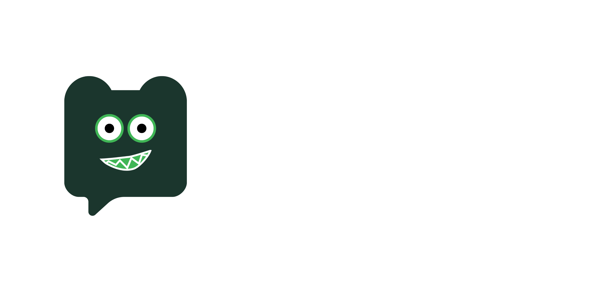

# MARK - Metacognitive Artificial Relational Knowledge


[](https://github.com/Mazees/mark-agent/releases/)

> **Mark BUKAN sekadar asisten virtual biasa. Mark adalah entitas AI yang dirancang untuk memiliki emosi dan bertindak selayaknya manusia.**
> Lebih dari sekadar chatbot kaku, Mark adalah _Personal AI Assistant_ yang berjalan di ekosistem lokal Anda—dilengkapi dengan sistem memori jangka panjang berbasis _Vector Memory_ dan **Relational Growth System** untuk mempelajari kebiasaan serta beradaptasi dengan gaya komunikasi Anda tanpa mengorbankan privasi sedikit pun. Ditenagai oleh _Hybrid AI Engine_, Mark dapat beroperasi secara lokal untuk privasi maksimal, atau menggunakan _Cloud APIs_ untuk mengeksekusi tugas kompleks, menyusun rencana (_Agentic Planning_), merangkum video YouTube, mengobservasi layar atau dunia nyata (_Vision_), melakukan riset internet, kendali jarak jauh via **Telegram Bot**, hingga berinteraksi melalui suara secara _real-time_.

> [!IMPORTANT]
> Proyek ini secara khusus dioptimasi untuk **Windows** (Windows 10/11).

## Fitur Unggulan

- **Dynamic Agentic Planning (ReAct Loop):** Mengganti sistem penjawab statis dengan arsitektur penalaran cerdas. Mark mampu memecah masalah, memikirkan strategi, menggunakan _tools_ secara otonom berulang kali, dan mengevaluasi hasilnya sebelum memberikan jawaban akhir yang komprehensif.
- **Agent Task Workflows:** Untuk pekerjaan panjang, router AI memilih mode `durable`, planner memecah pekerjaan menjadi beberapa step, lalu MARK mengerjakan satu step melalui ReAct loop yang sama. Setiap step divalidasi, di-checkpoint, dapat di-retry, dipause/resume setelah restart, dan menghasilkan artifact di `Documents/Mark Tasks/<task-id>/`.
- **Infinite Memory & Injection Knowledge RAG:** Sistem Vector Retrieval-Augmented Generation (RAG) kini berjalan secara _offline_. Mark dapat menyimpan riwayat memori obrolan masif tanpa batas dan pengguna dapat menambahkan pengetahuan dari sebuah file document tanpa membebani _context window_ utama LLM.
- **Automatic Memory Groomer (Hippocampus Engine):** Sistem pembersihan dan konsolidasi memori mandiri berbasis _Orama Clustering_ dan _LLM Batch Processing_. Hippocampus Engine berjalan otonom di latar belakang untuk mendeteksi klaster memori yang serupa atau duplikat (`profile` & `preference`), lalu menggabungkannya secara kronologis tanpa menghilangkan sejarah informasi. Dilengkapi _Grooming Status Bar_ dan tombol konsolidasi manual pada antarmuka _Memory Visualizer_.
- **Visualisasi Jaringan Otak (Memory Visualizer):** Dilengkapi dengan UI _Live Feed_ "Mark Neural Core". Pengguna dapat melihat secara _real-time_ grafis Neural Network yang menampilkan jaringan _Chat History_, _Knowledge Base_, hingga _Document Vault_.
- **Live Thought Process (Neural Flow):** Perhatikan Mark berpikir! Setiap kali sistem mengeksekusi rencana (_Agentic Planning_), antarmuka akan memancarkan animasi _3D Neuron_ yang terbang mengorbit inti pikiran (Orb) untuk interaktivitas tingkat _Sci-Fi_.
- **Relational Growth System & Dynamic Persona:** Hubungan Anda dengan Mark dievaluasi layaknya dengan manusia sungguhan melalui 4 parameter krusial (_Warmth, Sarcasm, Trust, Energy_). Tingkat kesopanan, kelancangan (_toxicity_), dan kepribadian Mark akan berevolusi organik. Jika Anda sering bersarkasme, Mark bebas menggunakan bahasa _tongkrongan_ dan men-_roasting_ Anda. Didukung oleh **9 Inside Out 2 Emotions** (Joy, Sadness, Fear, Anger, Disgust, Anxiety, Envy, Embarrassment, Ennui) yang secara dinamis mengubah warna UI Orb di layar.
- **Multi AI Provider (Built-in Gemini / Local / Cloud):** Mark hadir dengan **Google Gemini Engine (Gratis)** sebagai _provider_ bawaan yang siap pakai tanpa membutuhkan API Key. Anda juga memiliki fleksibilitas penuh untuk menggunakan **Local AI** (LM Studio berjalan di PC Anda), **Cloud AI** (Groq/Cerebras), maupun _Custom OpenAI-Compatible API_.
- **Asisten Bot Telegram Mandiri (Telegraf Engine):** Mark terhubung langsung dengan Telegram Bot API melalui pustaka `telegraf`. Mark dapat dikontrol jarak jauh via Telegram, merangkum obrolan, mengunduh MP3 YouTube, mengambil screenshot PC, dan secara otomatis menyinkronkan seluruh balasan PC & _Awareness Engine_ ke Telegram Admin secara _real-time_.
- **Physical PC & Desktop Automation (Windows UIAutomation):** Menggunakan mesin otomatisasi Windows lokal (`read-ui.ps1` & UIAutomation API), Mark dapat membaca elemen GUI desktop secara struktural, mengklik tombol, mengetik teks, menekan _shortcut_, hingga mengelola jendela aplikasi di Windows secara fisik tanpa biaya vision API yang tinggi (_Zero-Vision Cost_). Dilengkapi dengan _Security Floating Overlay_, sistem konfirmasi keamanan berlapis, serta tombol **Emergency Stop (`Ctrl+Shift+S`)** untuk keamanan kendali mutlak.
- **Proaktif dengan Awareness Engine:** Sistem Mark tidak hanya pasif merespons. Mark bisa proaktif menegur, menyapa, atau memutarkan musik di latar belakang. Dilengkapi fitur **Toggle** (bisa dimatikan kapan saja) dan integrasi sinkronisasi pesan proaktif ke Telegram Admin.
- **Floating Sub-Pages Glass UI:** Arsitektur antarmuka baru tempat `MarkHome` dan _AI Brain_ terus berjalan 100% aktif di latar belakang, sementara halaman lain (`TelegramBot`, `Configuration`, `Plugins`, `Knowledge`, `Guidebook`) dirender sebagai _Floating Glass Layer_ di atasnya tanpa memutus koneksi atau mematikan agen.

## Kemampuan Utama (Tools)

Mark dibekali dengan berbagai integrasi alat untuk mengeksekusi tugas di luar sekadar membalas teks:

- **Native File Handling & PowerShell:** Mark memiliki kontrol OS tingkat lanjut untuk membaca, menulis, memodifikasi, dan menghapus file secara _native_. Mark juga dapat mengeksekusi perintah PowerShell untuk mengendalikan sistem operasi. _(Keamanan Tinggi: Semua perintah berisiko wajib mendapat persetujuan modal UI dari pengguna)._
- **Otomatisasi Desktop PC (`os-*` tools):** Mengendalikan GUI Windows secara penuh (`os-control-open`, `os-read`, `os-click`, `os-type`, `os-key`, `os-scroll`, `os-open`, `os-list-windows`, `os-focus-window`, `os-ask`). Mark membaca elemen interaktif aplikasi aktif berbasis UIAutomation (dengan fallback OCR WinRT), mengklik, dan mengetik pada aplikasi apapun di desktop. Sistem mengunci sesi dengan _floating banner_ informatif, memerlukan izin eksplisit dari pengguna sebelum mengambil alih kendali, dan menyediakan fitur interupsi cepat via **`Ctrl+Shift+S`**.
- **Vision Awareness (Desktop Screen Reading):** Mark tidak lagi buta! Ia memiliki kemampuan membaca layar (`analyze-screen`) untuk "melihat" apa yang sedang terjadi di PC Anda. Terintegrasi dengan _Awareness Engine_, Mark bisa memberikan panduan sangat kontekstual berdasarkan aplikasi visual yang Anda buka.
- **Camera Vision (Mata Fisik):** Dilengkapi integrasi Webcam (`camera-look`), Mark dapat mengobservasi keadaan fisik Anda di dunia nyata. Fitur ini dapat dipicu manual maupun secara otonom oleh Mark sendiri jika diperlukan.
- **Autonomous Web Browsing:** Menggunakan _window_ Chromium internal, Mark dapat secara otonom membuka halaman web, bernavigasi, dan berinteraksi dengan website secara mandiri. Dilengkapi dengan _Smart Pause & Resume_ jika membutuhkan intervensi manual (login/CAPTCHA).
- **Interaksi Suara (Voice Activity Detection & STT):** Berbicara langsung ke mikrofon! Mark menggunakan sistem VAD cerdas yang mendeteksi suara Anda dan akan menunggu hingga Anda selesai berbicara sebelum memproses audio secara instan menggunakan _Groq Whisper STT_ atau _Local Transformers.js Whisper_. Balasan Mark juga menggunakan sintesis suara manusia yang natural (Edge-TTS).
- **Riset Internet Mendalam (Deep Web Search):** Mark dapat menelusuri web secara mandiri untuk mencari informasi akurat dan memberikan ringkasan yang dilengkapi dengan tautan kutipan (_citations_).
- **Perangkum YouTube Kilat:** Cukup berikan tautan video YouTube, dan Mark akan mengekstrak transkrip asli, memproses teks, dan memberikan ringkasan akurat tanpa Anda harus menonton video tersebut.
- **Pemutar YouTube Music Terintegrasi:** Terhubung langsung dengan ekosistem YouTube Music (tanpa iklan). Perintahkan Mark untuk memutar lagu, dan ia akan mencari serta memutarnya di latar belakang sembari menampilkan sampul album pada antarmuka.
- **Integrasi Bot Telegram:** Cukup masukkan API Token dari `@BotFather` dan Username Telegram (`@username`) Anda. Bot akan otomatis menyala di latar belakang saat aplikasi Mark dibuka di PC. Mark dapat mengeksekusi instruksi jarak jauh via Telegram (`tg-send`, `screenshot-to-tg`), mengirim hasil tangkapan layar, mengunduh musik MP3, serta menyinkronkan balasan obrolan PC & _Awareness Engine_ langsung ke HP Anda.
- **Sistem Plugin Kustom:** Tambahkan fitur atau kemampuan baru langsung dari antarmuka aplikasi tanpa perlu memodifikasi kode sumber inti. Anda dapat membuat skrip Node.js (misalnya, _plugin_ untuk mengatur volume atau mematikan PC) dan Mark akan langsung memahami cara menggunakannya.

## Arsitektur Proyek

```text
mark/
├── src/
│   ├── main/              # Proses Utama Electron (Window, IPC, TTS, Tray, Global Shortcut)
│   │   ├── telegram/      # Layanan Telegram Bot API (Telegraf Engine)
│   │   │   └── telegram-service.js  # Long-polling Bot, Filter Admin, Pengiriman Media & Sync IPC
│   │   ├── pc-agent.js            # Mesin Otomatisasi PC & Desktop Windows (UIAutomation)
│   │   ├── pc-agent-scripts/      # Skrip PowerShell untuk pembacaan UI & kontrol Windows
│   │   └── ai-bridge.js   # Penghubung utama ke AI API, Rate Limit, & Auto-Repair JSON
│   ├── preload/           # Skrip Preload (Jembatan keamanan Node.js ke React)
│   └── renderer/          # Frontend (React 19 + Vite)
│       └── src/
│           ├── api/
│           │   ├── ai/             # Modul Integrasi AI (chat, perencanaan, tools, memoryGroomer.js)
│           │   ├── db.js           # Skema & Migrasi Database Lokal (Dexie/IndexedDB)
│           │   ├── scraping.js     # Mesin pencari Google & web scraper
│           │   ├── vectorMemory.js # Sistem Memori Vektor (Transformers.js / LM Studio)
│           │   └── oramaStore.js   # Hybrid Full-Text & Vector Search, Memory Clustering
│           ├── components/         # Komponen UI modular (CodeBlock, ResponseArea, HoloCard, dll)
│           ├── hooks/              # Custom Hooks React (useMarkPlan, useTelegramBot, useAwareness, dll)
│           └── pages/              # Halaman UI Floating (MarkHome, Configuration, TelegramBot, Plugins, dll)
```

## Teknologi Terkait

| Kategori           | Teknologi                                                                                          |
| ------------------ | -------------------------------------------------------------------------------------------------- |
| **Framework**      | Electron 39, React 19, Vite 7                                                                      |
| **Antarmuka (UI)** | Tailwind CSS 4, DaisyUI 5, Framer Motion/GSAP (Animasi), React Force Graph 2D                      |
| **Mesin AI**       | Google Gemini (Bawaan Gratis) / LM Studio (Offline) / Groq, Cerebras, Custom OpenAI-Compatible API |
| **Memori Vektor**  | `@orama/orama` (Hybrid Search), Transformers.js (`@huggingface/transformers`)                      |
| **Pencarian Web**  | Electron Webview (Bypass Anti-Bot)                                                                 |
| **Suara & Audio**  | Groq API (STT), Transformers.js (Local STT), Edge-TTS, Web Audio API (VAD)                         |
| **Integrasi**      | `youtube-transcript-plus`, `youtube-dl-exec`, `ffmpeg-static`, `telegraf` Telegram Bot API         |
| **Database/RAG**   | Dexie.js (IndexedDB), `pdf-parse` (Document Extraction)                                            |

## Instalasi & Penggunaan

### Persyaratan Sistem

- **Sistem Operasi**: Windows 10/11
- **Node.js**: Versi 18 atau lebih baru
- (Opsional) **LM Studio** jika Anda ingin menjalankan model sepenuhnya secara luring (_offline_).
- (Opsional) **API Key Groq** untuk menggunakan model komputasi awan yang sangat cepat.

### Langkah Instalasi

1.  **Kloning repositori:**

    ```bash
    git clone https://github.com/Mazees/mark-agent.git
    cd mark-agent/mark
    ```

2.  **Instalasi dependensi:**

    ```bash
    npm install
    ```

3.  **Jalankan aplikasi:**

    ```bash
    npm run dev
    ```

4.  **Konfigurasi Awal:**
    Buka menu **Configuration** di dalam aplikasi, pilih penyedia AI Anda (LM Studio atau Groq), masukkan API Key, lalu atur penyedia _Vector Memory_ (Sangat disarankan menggunakan **Transformers.js** untuk pengalaman lokal tanpa perangkat lunak tambahan).

## 🔌 Sistem Plugin (Ekstensi Kustom)

Mark memungkinkan Anda memperluas kemampuannya dengan mudah melalui pembuatan **Plugin Kustom** secara langsung dari antarmuka pengguna, tanpa perlu mengubah kode inti aplikasi.

1. Buka menu **Plugins** pada _sidebar_ aplikasi.
2. Klik **Buat Plugin Baru**.
3. Isi kolom Nama (contoh: `pengendali-sistem`) dan Deskripsi singkat.
4. Jika skrip Anda memerlukan pustaka eksternal, tulis pada kolom **Dependencies (NPM)** dengan pemisah koma (contoh: `loudness, systeminformation`). Mark akan menginstalnya secara otomatis.
5. Tambahkan **Action** (Fungsi):
   - **Nama Action**: Penamaan fungsi (contoh: `set-volume`).
   - **Deskripsi**: Penjelasan spesifik mengenai fungsi tersebut agar AI memahami peruntukannya.
   - **Trigger Hint**: Petunjuk pemicu kapan AI harus menggunakan alat ini.
6. **Tulis Skrip Anda** menggunakan editor Monaco bawaan. Skrip mengikuti standar lingkungan Node.js (CommonJS).

#### Contoh: Plugin Pengatur Volume

```javascript
const loudness = require('loudness')

// Mengambil parameter angka volume yang diberikan oleh AI
const vol = parseInt(query)
if (isNaN(vol) || vol < 0 || vol > 100) {
  return '❌ Gagal: Masukkan angka volume 0-100.'
}

try {
  await loudness.setVolume(vol)
  return '✅ Berhasil, volume telah diubah ke ' + vol + '%'
} catch (e) {
  return '❌ Gagal mengubah volume: ' + e.message
}
```

7. Klik **Simpan Plugin**. Mark akan langsung mempelajari alat baru ini dan Anda dapat segera memerintahkannya untuk mengeksekusi skrip tersebut melalui teks atau perintah suara.

## Membangun Berkas Executable (Build)

Untuk membuat aplikasi mandiri (berkas `.exe`) yang dapat diinstal di PC Windows:

```bash
npm run build:win
```

Berkas _installer_ akan secara otomatis tersedia di dalam direktori `dist/`.

## Warning

**Dilarang keras menjual atau memperdagangkan perangkat lunak ini untuk keuntungan komersial tanpa izin tertulis.**

---

> Dibangun untuk masa depan AI yang lebih adaptif, dan manusiawi.
